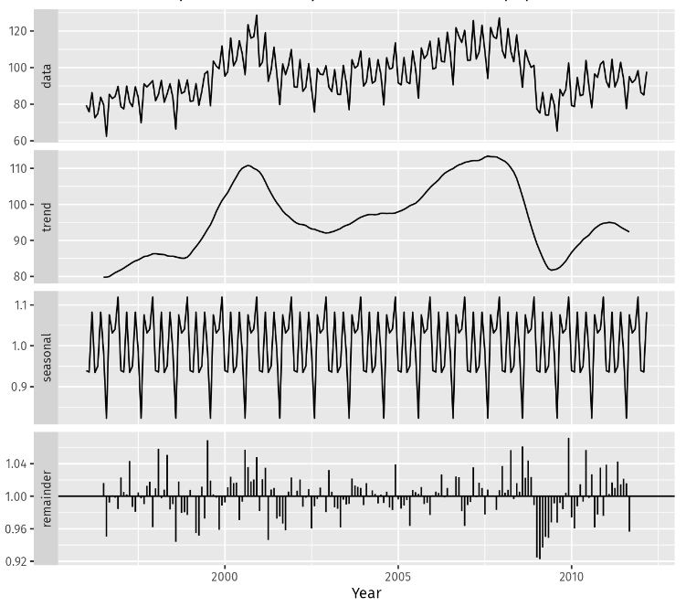

# Time series decomposition

This document describes statistical methods that can used for time series decomposition, with associated formulas and practical usage with Excel.

To make better forecast, it is usually required to separate the time series into different parts:

  - The **trend** $T_t$: model the low frequency variation, can be fit to a linear evolution
  - The **seasonality component** $S_t$: model periodic variations. First step is to identify the period, and second step is to estimate $S_t$
  - The **residuals** $R_t$: the random variation, that should have zero mean

There are **two** classical models (we will only focus on them for this course):

 - the **additive** model, where $Y_t = T_t + S_t + R_t$
 - the **multiplicative** model, where $Y_t = T_t \times S_t \times R_t$
 
 But more generally, each component can be either additive or multiplicative.

## Notations

Here is a list of the notations used throughout this document

 - $Y_t$: the data value at time $t$ 
 - $F_t$: the forecasted value at time $t$ 
 - $G_t$: the smoothed value at time $t$ 
 - $S_t$: the seasonal coefficient at time $t$
 - $R_t$: the residual at time $t$
 - $T_t$: the trend at time $t$

## Step by step methodology

 1. **VIZ**: Plot the time series, it is very important to take a look at the evolution of what you are studying. Clearly identify sampling frequency (daily, weekly, monthly, quarterly, yearly?).
 1. **TREND**: Identify if there is a trend, and whether trend is additive or multiplicative (is trend linear?)
 1. **SEASONALITY**: Identify if there is seasonality, and whether seasonality is additive or multiplicative (is the amplitude of period fluctuation increasing with time?) and it's period.
 1. **MODEL**: Build a model (additive or multiplicative for trend/seasonality) for your data and write the associated equation

 From here, methodologies are different for additive or multiplicative models

## Additive model

 1. **ESTIMATE TREND**: Estimate the trend $\hat{T_t}$ using central moving average or exponential smoothing. 
 1. **DETREND DATA**= Compute the detrended time series $D_t = Y_t - \hat{T_t}$ 
 1. **ESTIMATE SEASONAL COMPONENT**: Use $D_t$ to estimate seasonal component. You should average the values of the coefficient for each similar period (for instance, average all January component for yearly seasonality and monthly data). This gives $\hat{S_t}$ which is **periodic**.
 1. **ESTIMATE REMINDER**: Estimate the residuals $R_t = Y_r - \hat{T_t} - \hat{S_t})$
 1. **EVALUATE YOUR MODEL**: Before starting to forecast, plot $Y$, $S$, $T$ and $R$ and make sure your decomposition is sound.
 1. **FORECAST MODEL**: To perform a forecast, we usually use $Y_t = A_t + S_t$, regrouping trend and residuals into $A_t = T_t + R_t$. 
 
    - The seasonal component will remain periodic with the same values. 
    - A linear regression is performed on $A_t$ so $a$ and $b$ are estimated and we have $\hat{A_t} = at + b + R_t$.
    - Since $\hat{R_t}$ has no trend and no seasonality, a simple exponential smoothing can be used to forecast its values $\hat{R_r}$. Values in the future will simply be equal to the last forecast.
 1. **FORECAST**: Now to compute the forecast, just apply $F_t = \hat{A_t} + \hat{S_t}$, which is equivalent to: $\displaystyle F_t = at + b + \hat{R_r} + \hat{S_t}$

When using Excel to build such a model, you should have the folowing columns:

  - $t$: (1 to $N$)
  - $Y$: Data points
  - $\hat{T_t}$: Central moving average with $k$ points (k being the seasonal period)
  - $D$: Detrended time series $Y - \hat{T_t}$
  - $S$: Seasonal component
  - $A$: Seasonally adjusted component $Y - S$
  - $T$: $at + b$ using $a$ and $b$ from the linear regression of $A$ vs $t$
  - $R$: Residuals $Y-S-T$
  - $\hat{R}$: Forecast of $R$ using exponential smoothing with $\alpha$ being either fixed or solved to minimize the standard error.
  - $F$: Forecast of $Y$
  - $SE$: Standard error

## Multiplicative model

 1. **ESTIMATE TREND**: Estimate the trend $\hat{T_t}$ using central moving average or exponential smoothing. 
 1. **DETREND DATA**= Compute the detrended time series $D_t = Y_t / \hat{T_t}$ 
 1. **ESTIMATE SEASONAL COMPONENT**: Use $D_t$ to estimate seasonal component. You should average the values of the coefficient for each similar period (for instance, average all january component for yearly seasonality and monthly data). This gives $\hat{S_t}$ which is **periodic**.
 1. **ESTIMATE REMINDER**: Estimate the residuals $\displaystyle R_t = \frac{Y_r}{\hat{T_t}\hat{S_t}}$
  1. **EVALUATE YOUR MODEL**: Before starting to forecast, plot $Y$, $S$, $T$ and $R$ and make sure your decomposition is sound.
 1. **FORECAST MODEL**: To perform a forecast, we usually use $Y_t = A_t \times S_t$, regrouping trend and residuals into $A_t = T_t \times R_t$. The seasonal component will remain periodic with the same value, and any model for $A_t$ can be used.
 1. **FORECAST**: Now to forecast apply, just apply $F_t = \hat{A_t} + \hat{S_t}$

When using Excel to build such a model, you should have the folowing columns:

  - $t$ (1 to $N$)
  - $Y$: Data points
  - $\hat{T_t}$: Central moving average with $k$ points (k being the seasonal period)
  - $D$: Detrended time series $Y/\hat{T_t}$
  - $S$: Seasonal component
  - $A$: Seasonally adjusted component $Y / S$
  - $T$: $at + b$ using $a$ and $b$ from the linear regression of $A$ vs $t$
  - $R$: Residuals $Y/(S\times T)$
  - $\hat{R}$: Forecast of $R$ using exponential smoothing with $\alpha$ being either fixed or solved to minimize the standard error.
  - $F$: Forecast of $Y$
  - $SE$: Standard error

## Example

 Here is an example of a time series decomposition.
 
 
