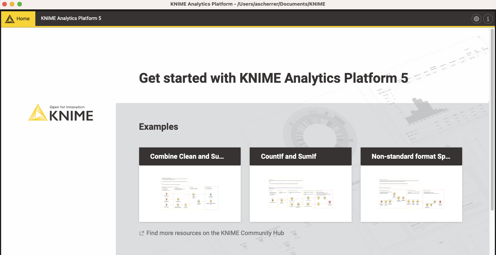
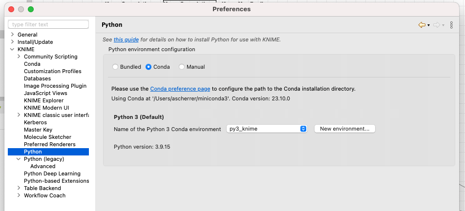
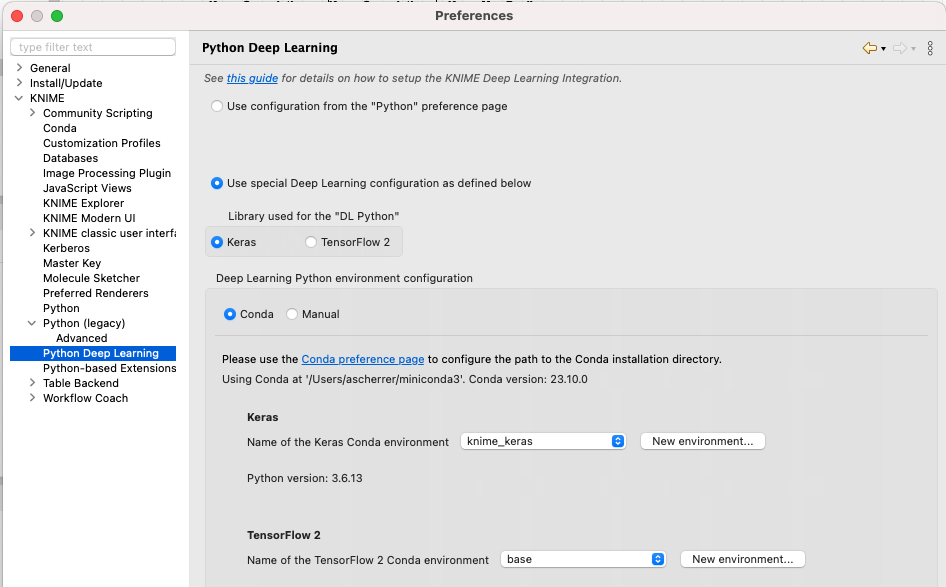

# Setting up a working Knime for AI practice

## Knime installation

1. Go to https://www.knime.com/downloads
1. Register 
1. Download knime for your platform -- **Be careful to download the appropriate version for your computer!**
1. Be patient, it's a large file to download...
1. Install knime

## Knime setup

1. Open knime, and select a folder where your workflows will be placed
1. Then, you should see something like
 
2.  Click on "i" button at the top right (highlighted in previous picture)
2.  Scroll down to find "Switch to
classic user interface" button and click on it 
4.  Go to File > Install KNIME Extensions
4.  Install the following extensions:

    * KNIME Optimization extension
    * KNIME Textprocessing
    * KNIME Deep learning - Keras integration
    * KNIME Image processing
    * KNIME Image processing - Deep Learning Extension 
    * KNIME Data generation
    * KNIME Javascript Views (labs)

5. *It will take a while...*
6. This is the list of extensions you should see if you click on "already installed" in the install extension menu.
 
6. Close KNIME


## Python installation 

The following steps are required only if anaconda is not installed on your computer.

1. Go to [`anaconda`](https://www.anaconda.com/download) and download anaconda for your computer

1. Install anaconda 

## Setup KNIME with Python

2. Open KNIME
1. Go to File > Preferences
1. Navigate to KNIME > Python (legacy)
 
1. Select Python 3 at the top
1. Select `conda` as python environment configuration
1. Don't worry about python2 (we will not use it)
1. For Python 3, click on "Create new environment"
1. This will take a while...
1. When completed reset KNIME

## Python environment for Keras

For Keras, a specific environment is required.

1. Open KNIME
1. Go to File > Preferences
1. Navigate to KNIME > Python Deep Learning
 
4. Select "Use special Deep learning configuration as defined below"
1. Select `Keras` as the library for DL Python
1. Select `conda` as python environment configuration
1. Don't worry about tensorflow 2 (we will not need it)
1. For Keras, click on "Create new environment"
1. For Windows/Intel MACs/Linux it should work. For Appel Silicon MAC, see below:

## Follow the steps below for Apple silicon (M1/M2) Mac

!!! warning annotate "Apple silicon (M1/M2) mac users"

    For Apple Silicon macs, you will need to create manually an environment because the required libraries at old and they havn't been compiled for M1/M2

1. Download Rosetta2 following [this procedure](https://support.apple.com/en-us/HT211861)
1. On your Mac, go to Application > Utilities and open the `Terminal` app
1. On the terminal here are the commands you need to execute:
``` shell
$ CONDA_SUBDIR=osx-64 conda create -n py3_knime_keras python=3.6
$ conda activate knime_keras
$ conda install h5py=2.8 tensorflow-mkl=1.12 keras=2.2.4
$ conda install pandas=0.23.0
```
4. Open KNIME 
1. Go to File > Preferences
1. Navigate to KNIME > Python Deep Learning 
1. For Keras, choose  py3_knime_keras as environment.

??? info "Package list on my installation for Keras"

    ```
    Package             Version
    ------------------- ---------
    absl-py             0.15.0
    astor               0.8.1
    certifi             2021.5.30
    coverage            5.5
    Cython              0.29.24
    dataclasses         0.8
    gast                0.5.3
    grpcio              1.36.1
    h5py                2.8.0
    importlib-metadata  4.8.1
    Keras               2.2.4
    Keras-Applications  1.0.8
    Keras-Preprocessing 1.1.2
    Markdown            3.3.4
    numpy               1.19.2
    pandas              0.23.0
    pip                 21.2.2
    protobuf            3.17.2
    python-dateutil     2.8.2
    pytz                2021.3
    PyYAML              5.4.1
    scipy               1.5.2
    setuptools          58.0.4
    six                 1.16.0
    tensorboard         1.12.2
    tensorflow          1.12.0
    termcolor           1.1.0
    typing_extensions   4.1.1
    Werkzeug            2.0.3
    wheel               0.37.1
    zipp                3.6.0
    ```
